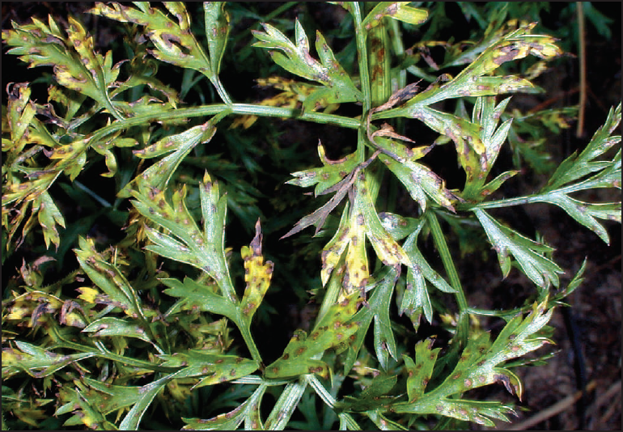

 ***Alternaria*** **and *Cercospora* leaf blights** are common fungal diseases of carrot leaves and petioles. While neither disease directly hurts the carrot root, yield loss occurs when petioles become so brittle that they break off during mechanical harvest leaving the carrot in the ground. In warm, moist weather, *Alternaria* leaf spots develop rapidly so that the entire field may appear to have been injured by frost or chemicals. Crop loss will be more severe when plants become infected early in the season.

*Alternaria* and *Cercospora* are difficult to distinguish in the field and often appear on the same plant. The principle difference involves disease timing. Cercospora leaf blight, caused by the fungus *Cercospora carotae*, attacks young rapidly growing plants; Alternaria leaf blight, caused by the fungus *Alternaria dauci*, primarily attacks older plants, although seedlings may also be infected.

### Model details

This Alternaria model is an implementation of the TOMCAST model described in Pitblado 1992, which builds on the FAST forecaster described by Madden et al 1978. The model generates daily Disease Severity Values (DSVs) based on the mean temperature and duration of leaf wetness periods (eg continuous hours with relative humidity \>90%).

### References

-   Pitblado 1992: TOM-CAST Tomato Disease Forecaster <https://atrium.lib.uoguelph.ca/server/api/core/bitstreams/5c7ec712-43ef-4b73-b8b8-e85c29d3d58b/content>
-   Madden et al 1978: FAST, a Forecast System for Alternaria solani on Tomato <https://www.apsnet.org/publications/phytopathology/backissues/Documents/1978Articles/Phyto68n09_1354.PDF>
-   More information: <https://vegpath.plantpath.wisc.edu/diseases/carrot-alternaria-and-cercospora-leaf-blights/>
