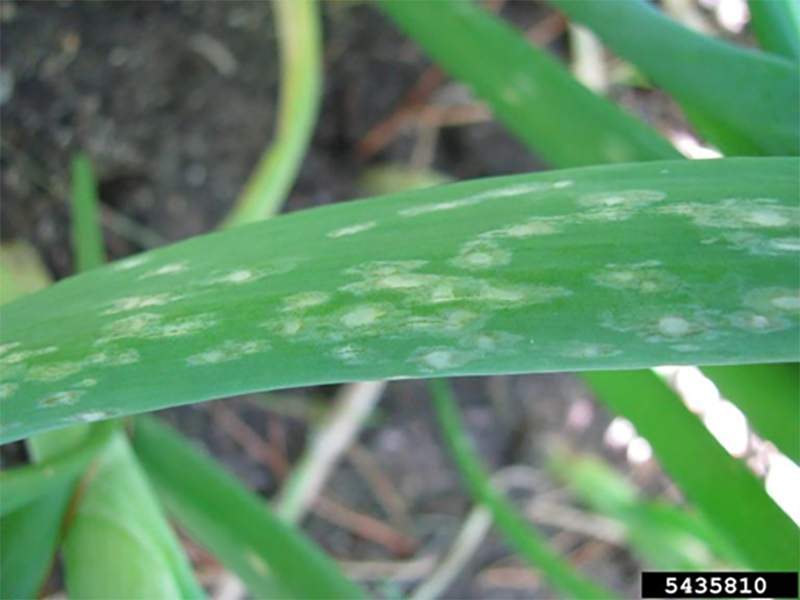

 **Onion Botrytis leaf blight/leaf spot** is a fungal disease of alliums caused by *Botrytis squamosa*. Symptoms first appear as small whitish spots on the leaf. These spots are oval-shaped, and sometimes surrounded by a light green or silver halo that often appears water-soaked. Leaf tips will begin to dry and wither as the disease progresses, sometimes until the whole leaf dies back. Progressed infection can stunt bulb growth and reduce yield. Heavily infected fields often appear yellowish and blighted. Severe infection can stunt bulb growth and reduce yield.

Primary infection occurs from *B. squamosa* spores that overwinter in infected in-field plant debris, cull piles, stored bulbs, volunteer bulbs in-field, and in infected soil. Secondary infection can occur when conidia spores spread from moist, infected leaves. Favorable conditions for disease development include high relative humidity and rainfall, prolonged leaf wetness, and warm temperatures.

### Model details

The Botrytis leaf blight model is based on the BOTCAST algorithm described in Sutton et al 1986. The model describes a two-step algorithm, where the first determies if inoculum is likely to be present or not, and the second estimates the risk of infection when potentially present.

### References

-   BOTCAST model: Sutton et al 1986 [https://doi.org/10.1016/0167-8809(86)90136-2](https://doi.org/10.1016/0167-8809(86)90136-2){.uri}
-   More information about onion Botrytis leaf blight: <https://vegpath.plantpath.wisc.edu/diseases/onion-botrytis/>
