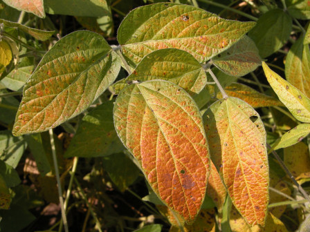

## Cercospora Leaf Blight (Soybean)

**Cercospora leaf blight** is caused by the fungus *Cercospora flagellaris* and other *Cercospora* species. This disease is frequently observed in soybean fields. Foliar symptoms usually are seen at the beginning of seed set and occur in the uppermost canopy on leaves exposed to the sun. Leaves are typically only discolored on the upper surface with symptoms ranging from light purple, pinpoint spots to larger, irregularly shaped patches. Affected leaves may become leathery and dark purple with bronze highlights. Symptoms may be confused with sunburn, which typically occurs on the leaf underside. Warm and wet weather favors infection and development of disease. There are commercially available varieties resistant to Cercospora leaf blight. Foliar fungicides are registered for Cercospora leaf blight. Although caused by the same organisms, there is no consistent relationship between occurrence of Cercospora leaf blight and purple seed stain.

### Model details

This model predicts the probability of spore presence for each of three species: *C. flagellaris*, *C. sigesbeckiae*, and *C. kikuchii*.

### References

- Crop Protection Network Encyclopedia: <https://cropprotectionnetwork.org/encyclopedia/cercospora-leaf-blight-of-soybean>
