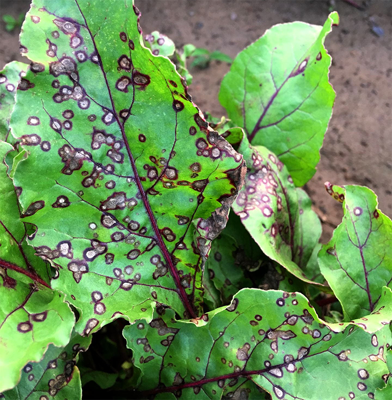

 **Cercospora leaf spot (CLS)** and resultant defoliation is caused by the fungus *Cercospora beticola* Sacc. and is one of the most damaging diseases of table and sugar beet crops worldwide. Disease symptoms are initially discrete and necrotic lesions with red to purple margins red table beets. Lesions have gray centers and contain diagnostic fungal structures (pseudostromata). For large scale table beet production, defoliation may lead to challenges with mechanical harvest and crop loss. For fresh market, 'bunched beet' sale, foliar lesions can result in rejection. CLS control in conventional table beet requires preventative fungicide applications. Timing of the application of fungicides with disease forecasting can greatly enhance control to limit inoculum within the crop for full season disease control.

### Model details

The Cercospora leaf spot model is based on the algorithm described by Windels et al 1998 which provides a lookup table for Daily Infection Values (DIVs) based on the number of hours in a day where relative humidity is \>90%, and the mean temperature during those hours.

### References

-   Windels et al 1998: A Cercospora Leaf Spot Model for Sugar Beet <https://apsjournals.apsnet.org/doi/abs/10.1094/PDIS.1998.82.7.716>
-   More information: <https://www.vegetables.cornell.edu/pest-management/disease-factsheets/cercospora-leaf-spot-of-table-beet/>
