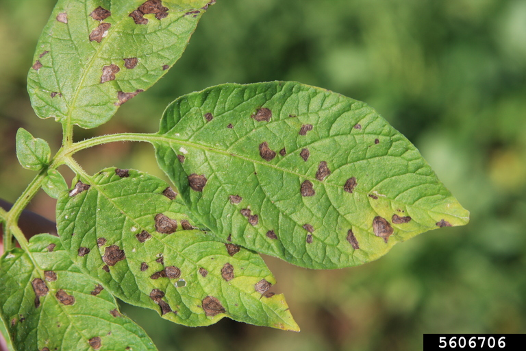

 **Early blight** is a common fungal disease of solanaceous crops (tomatoes, potatoes, peppers, eggplants) caused by *Alternaria solani*. Symptoms first appear as circular dark-brown spots on leaves and stems that can later develop concentric, target-like rings, often surrounded by yellow margins. Lesions are sometimes limited by veins, giving an ‘angular’ appearance. Early foliar symptoms often appear near the base of the plant, spreading up to higher leaves as the disease progresses. On tubers, lesions appear as dark, sunken, cork-like spots with raised margins, although tuber symptoms are less frequently seen in the Midwestern U.S.

When conditions are right, overwintering spores (conidia) can travel within and between fields and infect healthy plant tissue. Spores can spread via wind, splashing rain, irrigation water, equipment, and workers. Spores can then spread locally from infected tissue in a similar manner. Favorable conditions for early blight development and spread include canopy closure, high humidity, prolonged leaf wetness, poor airflow, nitrogen deficiency. Older or senescing leaves are most susceptible to early blight infection. Once the growing season is over, the pathogen can overwinter on infected soil-bound plant debris for several years.

### Model details

The early blight model is based on the accumulation of potato physiological days (P-days) as described in Pscheidt and Stevenson 1988. Risk is based on cumulative P-days since crop emergence, with the highest risk (and when initial fungicide applications should be targeted) coinciding with 350-400 cumulative P-days.

### References

-   Pscheidt and Stevenson 1988: The critical period for control of early blight (Alternaria solani) of potato <https://link.springer.com/article/10.1007/BF02854357>
-   More information: <https://vegpath.plantpath.wisc.edu/diseases/potato-early-blight/>
