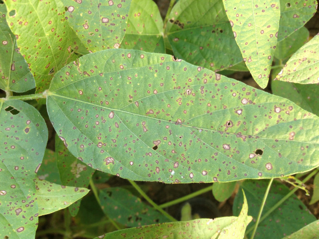

 Frogeye leaf spot is caused by the fungus *Cercospora sojina*. The disease occurs across the United States and in Ontario, Canada. Frogeye leaf spot can cause significant yield loss when widespread within a field. Leaf lesions are small, irregular to circular in shape, and gray with reddish-brown borders. Most commonly occurring on the upper leaf surface, lesions start as dark, water-soaked spots that vary in size. As lesions age, the central area becomes gray to light brown with dark, red-brown margins. In severe cases, disease can cause premature leaf drop and will spread to stems and pods.

The fungus survives in infested crop residue and infected seed. Early season infections contribute to infection of foliage and pods later in the season. Warm, humid weather promotes spore production, infection, and disease development. Young leaves are more susceptible to infection than older leaves, but visible lesions are not seen on young, expanding leaves because the lesions take two weeks to develop after infection.

Resistant soybean varieties are available and should be used where disease is a potential problem. Several races of the pathogen have been identified, and varieties with resistance to all known races are available. Rotating to a non-host crop and tillage will reduce survival of *C. sojina*. Crops not susceptible to this pathogen are alfalfa, corn, and small grains. Foliar fungicides applied during late flowering and early pod set to pod filling stages can reduce frogeye leaf spot.If you believe fungicide resistance may be an issue in your field, contact your local extension specialist.

### Model details

The frogeye leaf spot model is based on logistic equations developed by Smith and Webster which calculate the probability of spore presence. Risk scores are assigned based on these probabilities.

### More information

-   Crop protection network: <https://cropprotectionnetwork.org/encyclopedia/frogeye-leaf-spot-of-soybean>
