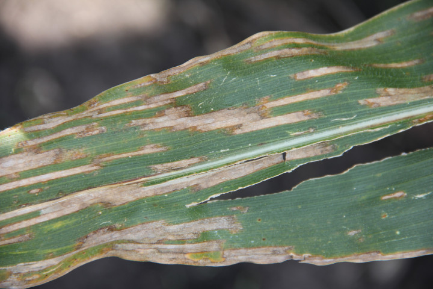

Gray leaf spot, caused by the fungus *Cercospora zeae-maydis*, occurs virtually every growing season. If conditions favor disease development, economic losses can occur. Symptoms first appear on lower leaves about two to three weeks before tasseling. The leaf lesions are long (up to 2 inches), narrow, rectangular, and light tan colored. Later, the lesions can turn gray. They are usually delimited by leaf veins but can join together and kill entire leaves.

The fungus survives in corn residue, and, consequently, the disease is often more severe in corn following corn. Spores are dispersed by wind and splashing water. Infection of corn leaves and disease development are favored by warm (80s°F), humid (\>90% for 12+ hours) weather. Disease severity depends on hybrid susceptibility and environmental conditions.

Resistant hybrids and inbreds are available. Crop rotation and tillage reduce survival of the fungus. Foliar fungicides labeled for gray leaf spot are available.

### Model details

The gray leaf spot model is based on logistic equations developed by Smith and Webster which calculate the probability of spore presence. Risk scores are assigned based on these probabilities.

### More information

-   Crop protection network: <https://cropprotectionnetwork.org/encyclopedia/gray-leaf-spot-of-corn>
