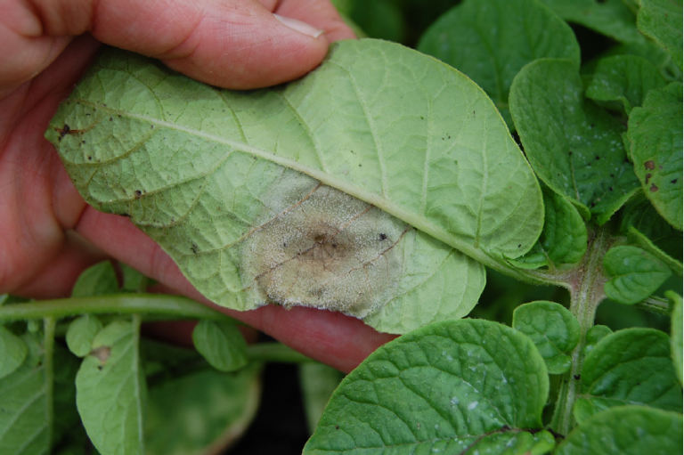

 Late blight is a disease that typically causes severe symptoms on flowering plants of the family *Solanaceae*. The pathogen that causes late blight, *Phytophthora infestans*, infects a variety of *Solanum* spp., including eggplant, pepper, nightshades, and petunia. However, it is most infamously known for its destruction of potato, *S. tuberosum*, and tomato, *S. lycopersicum*.

*Phytophthora infestans* infects all aboveground plant parts and potato tubers and can be transmitted via seed, culls, volunteers, and weeds (i.e., nightshade). Foliar infections begin with watersoaking and progress quickly to cause tan/brown dead tissue. Brown cankers can girdle petioles and stems. White, downy sporulation is often visible, with high humidity, on undersides of leaves along lesion edges. Infected tomato fruits remain firm underneath mottled-looking brown areas. Infected tubers appear as brown decay on the surface and into the top ¼-inch of tissue. Late blight disease advances quickly under conditions of high humidity (≥90%) and cool temperatures (50-70°F). Prevention is critical for control. Eliminate culls and volunteer plants. Avoid prolonged wetness on leaves and canopy, use certified seed, and follow DSV accumulation values that prompt early, preventative fungicide applications. If disease is present, treat with appropriate fungicides on a 5-7 day spray interval.

### Model details

Late blight daily disease severity values (DSVs) are calculated based on the BLITECAST algorithm described by Krause, Massie, and Hyre in 1975 and based on work previously conducted by Wallins. The risk of late blight is then based on the cumulative and rolling 14-day average number of DSVs.

### References

-   BLITECAST model: <https://www.google.com/books/edition/The_Plant_Disease_Reporter/ow9BD6P2KZ4C?hl=en&gbpv=1&pg=PA95&printsec=frontcover>
-   More information about late blight: <https://vegpath.plantpath.wisc.edu/diseases/potato-late-blight/>
