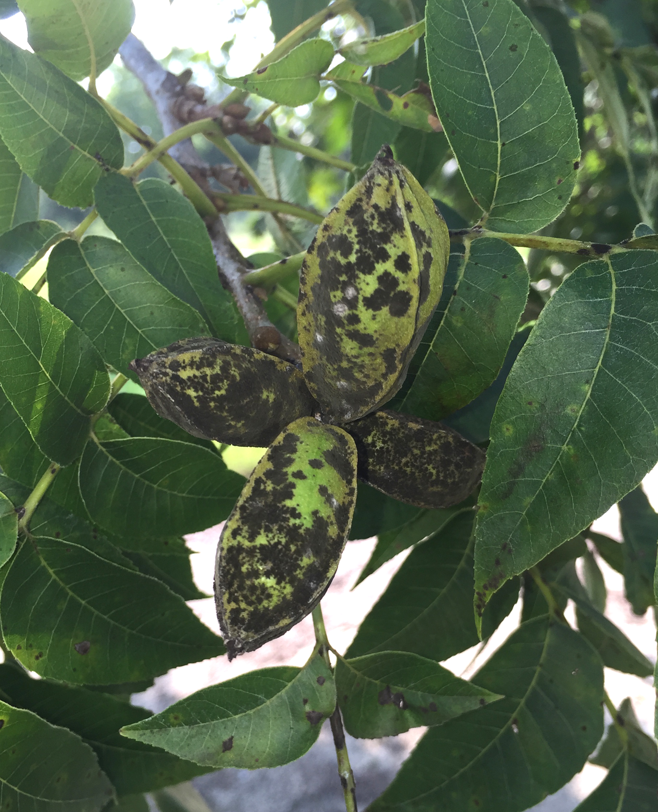

# Pecan Scab

**Pecan scab**, caused by the biotrophic fungus *Venturia effusa* (formerly *Fusicladium effusum*), is the most economically destructive disease affecting pecan production across the southeastern and midwestern United States. The fungus overwintersthes as stroma in plant debris, shucks, and twigs, releasing microscopic spores (conidia) during warm, humid spring weather. These spores are spread by wind and rain splashing, targeting rapidly growing, immature pecan tissues. Successful infection requires periods of prolonged leaf wetness or high relative humidity, making the timing of early-season rainfall a critical driver of epidemic severity. If left unmanaged, the disease causes olive-green to black lesions on leaves and nut shucks, leading to premature defoliation, poor nut filling, and severe crop loss. Modeling these weather-driven infection risks allows growers to optimize fungicide application schedules, maximizing control while minimizing unnecessary chemical inputs.

### Model details

The model implemented on this tool is based on the Oklahoma Mesonet's Pecan Scab Advisor, an online weather-based management tool that identifies times when the risk of pecan scab infection is high. It is seasonal and operates between March 1 and August 31. The advisory
is based on the accumulation of "pecan scab hours" which are defined as one hour with relative humidity greater than or equal to 90% and temperatures greater than or equal to 70°F.

### Model interpretation

Spraying is recommended when 10 pecan scab hours have accumulated for highly susceptible varieties, and it has been either 30 days after March 1 or 5 to 14 days from the last fungicide application. For moderately susceptible varieties, it is 20 pecan scab hours, and 30 scab hours for low susceptible varieties. Consult your local extension professional for more information.

- **Highly Susceptible Varieties (10 Scab Hours):** Burkett, Desirable, Maramec, Pawnee, Peruque, Western, and Wichita.
- **Moderately Susceptible Varieties (20 Scab Hours):** Caddo, Choctaw, Colby, Creek, Giles, Kiowa, Mohawk, Nacono, Oconee, Stuart, and Zinner.
- **Low Susceptible Varieties (30 Scab Hours):** Excel, Hark, Kanza, Lakota, Mount, and Osage. 

### References

- https://www.mesonet.org/agriculture/horticulture/pecan/pecan-scab-advisor