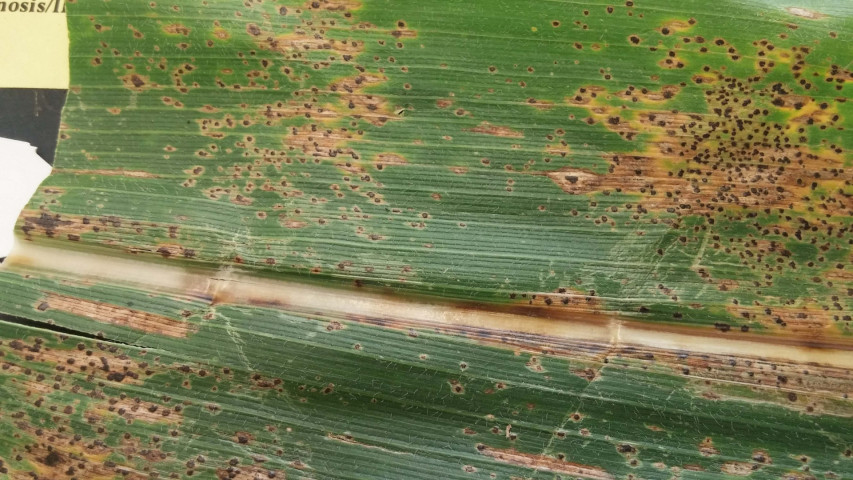

 Tar spot is caused by the fungus *Phyllachora maydis*, and can cause severe yield loss on susceptible hybrids when conditions are favorable for disease. Tar spot appears as small, raised, black spots scattered across the upper and lower leaf surfaces. These spots are stromata (fungal fruiting structures). If viewed under the microscope, hundreds of sausage-shaped asci (spore cases) filled with spores are visible. When severe, stromata can even appear on husks and leaf sheaths.

Tan to brown lesions with dark borders surrounding stromata can also develop. These are known as "fisheye" lesions. In Latin America, where tar spot is more common, fisheye lesions are associated with another fungus, Monographella maydis, that forms a disease complex with P. maydis known as the tar spot complex. M. maydis has not been detected in the United States.

At the end of the growing season, common and southern rust pustules can be mistaken for tar spot stromata as these rusts switch from producing orange-red spores (urediniospores) to black spores (teliospores). However, rust spores burst through the epidermis and the spores can be scraped away from the pustules with a fingernail while tar spots cannot be scraped off the leaf tissue.

The pathogen that causes tar spot overwinters on infested corn residue on the soil surface, and it is thought that high relative humidity and prolonged leaf wetness favor disease development.

Residue management, rotation, and avoiding susceptible hybrids may reduce tar spot development and severity. Some fungicides may also reduce tar spot, although little data exists regarding application timing for efficacy and economic response.

### Model details

The tarspot model is based on logistic equations described by Webster et al 2023 which calculate the probability of spore presence. Risk scores are assigned based on these probabilities.

### More information

-   Webster et al 2023: Uncovering the environmental conditions required for Phyllachora maydis infection and tar spot development on corn in the United States for use as predictive models for future epidemics <https://doi.org/10.1038/s41598-023-44338-6>
-   Crop protection network: <https://cropprotectionnetwork.org/encyclopedia/tar-spot-of-corn>
