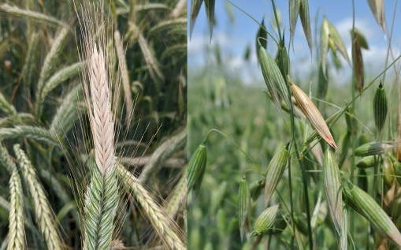

 **Fusarium head blight (FHB)** is currently the most economically important wheat disease in the U.S. and Canada. This disease is also known as scab or head blight and is caused by the fungus *Fusarium graminearum* and other *Fusarium* spp. It reduces yield and produces mycotoxins that impact human and animal health. Infected spikelets are bleached and disease spreads upward and downward by sequentially infecting spikelets. Pink or orange spore masses can sometimes be observed on infected spikelets, particularly at the base. Small, dark fruiting structures may also be present on spikelets. Infected kernels become shriveled, chalky, and can be discolored white-pink. These "tombstone" kernels are lightweight and highly contaminated with mycotoxins. Tombstone kernels often blow away with chaff. The pathogen can survive on infected host residue. Warm, wet weather with high relative humidity during flowering (anthesis) and early grain formation favors disease development.

After infection the mycotoxin deoxynivalenol (DON or vomitoxin) is produced by the fungus. DON accumulation is favored when conditions after anthesis remain warm and wet.

Moderately resistant wheat varieties are available. Encourage decomposition of plant residue through tillage when possible, rotate away from a host crop (corn or small grains) for at least one year, and plant high-quality, disease free seed. Properly adjust combines to help discard lightweight, moldy kernels, and to reduce damaged kernels, which are more susceptible to mold. Fungicides, primarily triazoles (FRAC group 3), are labeled for FHB. Application is recommended when favorable conditions for FHB exist prior to and throughout heading. The best application timing is early flowering (FGS 10.51), but application up to 7 days after initiation of flowering can reduce FHB and mycotoxin contamination. Do not use QoI (strobilurin; FRAC group 11) fungicides as these can increase mycotoxins.

Harvest fields with FHB separately and avoid mixing contaminated and non-contaminated grain. Store moldy grain appropriately to minimize impact on grain quality. Molded grain should be tested for mycotoxins prior to feeding.

**Model Details**

The FHB risk model is based on logistic equations developed by Shah, Paul, DeWolf, and Madden which calculate the probability of FHB risk using relative humidity readings for 14 days prior to flowering (anthesis). Risk scores are adjusted based on relative susceptibility of the wheat variety being grown. The user must input wheat resistance category and understand when flowering begins for that variety.

**More Information**

-   <https://cropprotectionnetwork.org/publications/an-overview-of-fusarium-head-blight>

-   <https://crop-protection-network.s3.amazonaws.com/publications/cpn-3001-wheat-optimizing-fungicide-use-for-fusarium-head-blight-scab-and-associated-mycotoxins.pdf>
