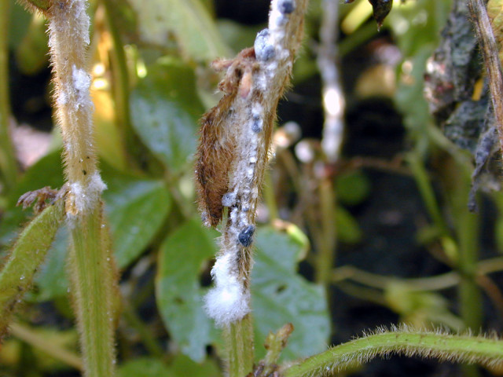

 White mold (also called *Sclerotinia* stem rot) is a significant problem in the North Central soybean production region and Canada. Caused by the fungus *Sclerotinia sclerotiorum*, white mold is often recognized by fluffy, white growth on soybean stems. Initial symptoms generally develop from R3 to R6 as gray to white lesions at the nodes. Lesions rapidly progress above and below the nodes, sometimes girdling the stem. White, fluffy mold soon covers the infected area, especially during periods of high relative humidity. Characteristic black sclerotia eventually are visible and embedded within mold on stem lesions, and inside the stem as the plant approaches death. Initial foliar symptoms include leaf tissues between major veins turning a gray-green cast; eventually leaves die and turn completely brown while remaining attached to the stem. Pods affected by white mold generally contain seeds that are smaller, lighter, white, and cottony. Seeds may be replaced by sclerotia. It is unusual for an infected seed to look normal. Soybean seed lots can be contaminated with sclerotia, the survival structures produced by *S. sclerotiorum* in infected plants.

The fungus survives in the soil for several years as sclerotia. The disease cycle begins when mushroom-like structures called apothecia are formed on the soil surface from sclerotia. Spores from apothecia infect senescing soybean flowers and the fungus eventually grows to the stem. The disease is more prevalent during cool, wet, or humid seasons and in fields where the canopy closes during soybean flowering and early pod development.

No soybean variety is completely resistant to white mold, but varieties do range from moderately resistant to very susceptible. At least two or three years of a non-host crop can reduce the number of sclerotia in soil. Crops that should not be in rotation with soybean in fields with white mold risk are beans, peas, sunflowers, and cole crops (mustard or Brassicaceae family). More sclerotia are found near the soil surface in no-till systems, but sclerotia numbers begin to decline if left undisturbed. Early planting, narrow row width, and high plant populations all accelerate canopy closure and favor disease development. However, modification of these practices also may reduce yield potential. Weed control is critical as many broadleaf weeds are hosts of the white mold pathogen. Also, some herbicides may suppress the activity of the fungus or disrupt germination of sclerotia. Some antagonistic fungi may be applied to the soil to colonize and reduce sclerotia numbers. Foliar fungicides can manage white mold, or at least reduce disease severity; however, application timing is critical. Fungicides are most effective when applied immediately before infection.

### Model details

The white mold model is based on logistic equations described in Willbur et al 2018 which calculate the probability of spore presence. Risk scores are assigned based on these probabilities.

### More information

-   Willbur et al 2018: Weather-based models for assessing the risk of Sclerotinia sclerotiorum apothecial presence in soybean (Glycine max) fields <https://doi.org/10.1094/PDIS-04-17-0504-RE>
-   Crop protection network: <https://cropprotectionnetwork.org/encyclopedia/white-mold-of-soybean>
